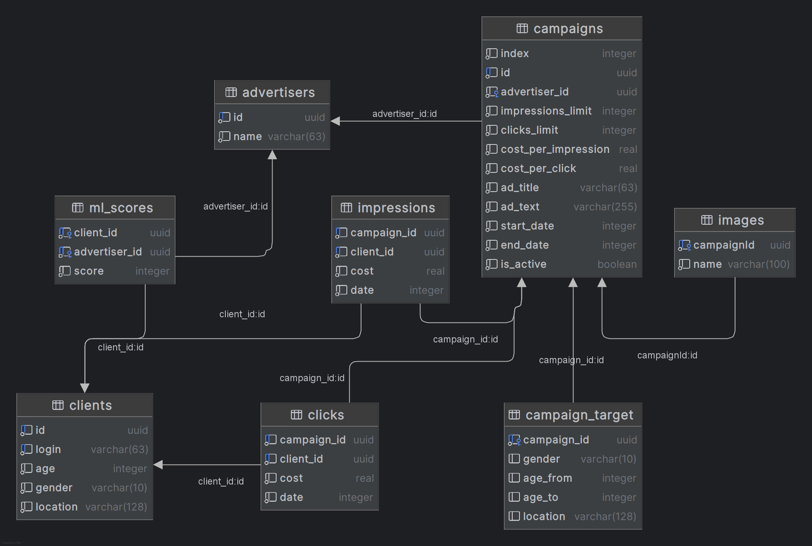

# SUPERADVERTISING - 3300

- [Описание проекта](#описание-проекта)
- [Запуск проекта](#запуск-проекта)
- [Алгоритм подбора рекламы](#алгоритм-подбора-рекламы)
- [Важные аспекты работы платформы](#аспекты-работы)
- [Точки входа](#точки-входа)
- [Выбор технологий](#выбор-технологий)
- [Используемые библиотеки](#используемые-библиотеки)
- [Описание схемы данных](#описание-схемы-данных)

## Описание проекта
SUPERADVERTISING - это рекламная платформа, позволяющая управлять рекламными кампаниями, анализировать статистику и использовать AI для генерации рекламных текстов. Проект использует стек технологий, обеспечивающий надежность, масштабируемость и удобство работы с данными.

## Запуск проекта
Подготовка к запуску:
```
git clone https://gitlab.prodcontest.ru/2025-final-projects-back/CWSHBR
cd CWSHBR/solution
```

Запуск производится командой:
```
docker compose up -d
```

Файл `docker-compose.yml` содержит описание всех необходимых сервисов для работы проекта, включая:
- **rabbitmq** (rabbitmq:3.10.7-management) - брокер сообщений для обработки очередей
- **db** (postgres:15) - основная база данных
- **minio** (docker.io/bitnami/minio:2025) - объектное хранилище
- **redis** (redis:7) - NоSQL СУБД (используется Superset в качестве кэша)
- **superset** - один из сервисов для локального запуска Superset
- **superset-init** - инициализация перед запуском Superset
- **superset-worker** - один из сервисов Superset
- **superset-worker-beat** - один из сервисов Superset
- **advertising** - сервис бэкенда платформы
- **tgbot** - сервис телеграм-бота

#### Порядок зависимостей:
    (db, redis) -> (superset-init) -> (superset, superset-worker, superset-worker-beat) -> (advertising) -> (tgbot)

Это требуется для корректного импорта дашбордов в Superset и проведения миграций базы данных.

#### Взаимодействие с платформой
Backend - сервис будет отвечать на порте `8080` \
Визуализация (superset) - доступен на порте `8088`. Логин/пароль: `admin`/`admin` \
Telegram bot - отвечает в [Телеграме](https://t.me/advertizerplatformbot)

---

## Алгоритм подбора рекламы
### Первичный отбор
Первичный отбор рекламных кампаний производится с помошью SQL запроса:
```sql
    select cid,
       (5*(cpi * 1.2 + cpc * 0.7) + ml/2.5) AS score from 
    (
        select campaigns.id as cid,
        ms.score as ml, campaigns.cost_per_impression as cpi, campaigns.cost_per_click as cpc from campaigns
        inner join public.campaign_target ct on campaigns.id = ct.campaign_id
        inner join (select * from unnest(?, ?) as x(id, score)) ms on ms.id = cast(advertiser_id as text)

        where (select count(*) from impressions where impressions.campaign_id = campaigns.id) < (campaigns.impressions_limit * 1.04)
        and campaigns.start_date <= ?
        and ? <= campaigns.end_date
        and is_within_area(?, ct.location) = 1
        and is_age_in_lower_lim(?, ct.age_from) = 1
        and is_age_in_upper_lim(?, ct.age_to) = 1
        and is_gender_match(?, ct.gender) = 1
    ) as subquery
    order by score DESC, cpi DESC, cpc DESC, ml DESC
```
1) Отбираются кампании, которые: 
    - в данный день активны
    - не превышен лимит показов
    - подходят данному клиенту по настройкам таргетинга 
2) Далее по формуле `5*(cpi * 1.2 + cpc * 0.7) + ml/2.5` вычисляется некий _коэффицент релевантности рекламы_ по которому в дальнейшем производится сортировка по убыванию

### Вторичный отбор
В вторичном отборе мы из списка кампаний убираем те кампании, чья реклама уже была показана данному клиенту.

### Показ рекламы
После двух отборов, мы выбираем первую в списке из оставшихся реклам и показываем пользователю. \
В случае если список оказался пустым - выводим 404.  

---

## Аспекты работы
### API Backend
Важные аспекты API указаны в [OpenAPI спецификации](solution/advertising-platform-api/src/main/resources/CWSHBR-openapi.yaml)
### Telegram Bot
Начальные команды:
- `/login {advertiserId}` - некий _вход в систему_ под ID рекламодателя
- `/mycampaigns` - вывод списка кампаний рекламодателя
- `/stats` - статистика для рекламодателя за все время

Сценарии и логику бота можно найти в [файле](solution/extradocs/TELEGRAM-BOT.md)

Интерфейс интуитивно понятный, сложностей у пользователя возникать не должно

---

## Точки входа

### Рекламные объявления
- `GET /ads` - получение рекламы пользователем
- `POST /ads/{adId}/click` - засчитать клик пользователя

### Рекламодатели
- `POST /advertisers/bulk` - массовое добавление рекламодателей
- `GET /advertisers/{advertiserId}` - получение рекламодателя по ID
- `GET /advertisers/{advertiserId}/campaigns` - получение списка всех кампаний у рекламодателя (пагинация: `size` & `page`, `page` отсчет с нуля)
- `POST /advertisers/{advertiserId}/campaigns` - создание новой рекламной кампании
- `GET /advertisers/{advertiserId}/campaigns/{campaignId}` - получение рекламной кампании
- `PUT /advertisers/{advertiserId}/campaigns/{campaignId}` - изменение рекламной кампании
- `DELETE /advertisers/{advertiserId}/campaigns/{campaignId}` - удаление рекламной кампании
- `POST /advertisers/{advertiserId}/campaigns/{campaignId}/generatetext` - генерация рекламного текста с помощью YandexGPT

### Изображения
- `GET /advertisers/{advertiserId}/campaigns/{campaignId}/image` - получение изображения рекламной кампании
- `POST /advertisers/{advertiserId}/campaigns/{campaignId}/image` - добавление или изменение изображения рекламной кампании

### Клиенты
- `POST /clients/bulk` - массовое добавление клиентов
- `GET /clients/{clientId}` - получение клиента по ID

### ML-оценка
- `POST /ml-scores` - добавление или изменение параметра ML-score для пары рекламодатель-клиент

### Модерация
- `POST /moderation` - включение или выключение модерации
- `POST /moderation/addrestrictedwords` - добавление запрещенных слов для модерации текста

### Статистика
- `GET /stats/advertisers/{advertiserId}/campaigns` - общая статистика за все время по кампаниям рекламодателя
- `GET /stats/advertisers/{advertiserId}/campaigns/daily` - дневная статистика по кампаниям рекламодателя
- `GET /stats/campaigns/{campaignId}` - общая статистика за все время по кампании
- `GET /stats/campaigns/{campaignId}/daily` - дневная статистика по кампании

### Управление временем
- `POST /time/advance` - изменение дня в системе

## Выбор технологий

### PostgreSQL (Главная база данных)
- Надежность и соответствие ACID
- Масштабируемость и высокая производительность

### Minio (S3-совместимое объектное хранилище)
- Поддержка S3 API, удобство интеграции
- Гибкость и отказоустойчивость
- Хорошая производительность при работе с изображениями

### RabbitMQ (Очередь сообщений)
- Используется для очередей запросов к YandexGPT
- Гибкость в обработке фоновых задач
- Высокая надежность и поддержка подтверждений доставки

### Superset (Визуализация данных)
- Уже есть опыт работы с этим инструментом
- Удобный UI для анализа данных
- Возможность построения сложных дашбордов

### YandexGPT (Генерация текстов)
- Доступность благодаря гранту
- Хорошее качество генерации рекламных текстов

---

## Используемые библиотеки
- `Ktor server` - серверный фреймворк
- `Ktor client` - клиент для взаимодействия с внешними API
- `AWS SDK` - работа с S3 (Minio)
- `Exposed` - ORM для PostgreSQL
- `HikariCP` - пул соединений с базой данных
- `Logback` - логирование
- `ktor-server-test-host` - тестирование серверной части
- `kotlin-test-junit` - тестирование
- `damirdenis-tudor:ktor-server-rabbitmq` - интеграция с RabbitMQ
- `dev.inmo:tgbotapi` - работа с Telegram API

---

## Описание схемы данных

#### Краткое описание таблиц:
- `advertisers` - Рекламодатели
- `clients` - Клиенты
- `ml_scores` - ML-score для пары рекламодатель-клиент _(Записи попарно уникальны. То есть пара adv1-client1 встретится лишь единожды)_
- `campaigns` - Рекламные кампании
- `campaign_target` - Настройки таргетирования для кампании _(Уникальность по campaign_id)_
- `images` - Таблица сопоставления названия файла картинки в хранилище к ID кампании. _(Уникальность по campaign_id)_
- `impressions` - Просмотры рекламы. _(Записи попарно уникальны. Сохранияется цена на момент просмотра. Не удаляется при отсутсвии кампании или клиента.)_
- `clicks` - Клик по рекламе. _(Записи попарно уникальны. Сохранияется цена на момент клика. Не удаляется при отсутсвии кампании или клиента.)_

#### Более подробное описание [тут](solution/extradocs/DATABASE-DESCRIPTION.md)

---

## CREDITS

Выражаю искреннюю благодарность организаторам и проверяющим олимпиады ПРОД за интересное и сложное задание этого этапа.  Спасибо за возможность прокачать свои знания и применить их на практике! 