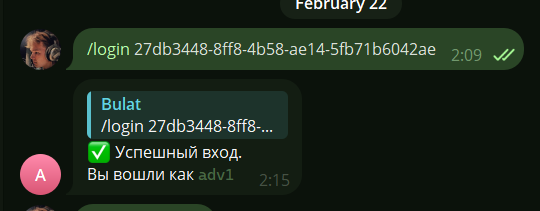

## Сценарии и логика ТГ бота
Данный бот удобен как карманный доступ к платформе. \
Он может:
- Получить данные всех кампаний рекламодателя
- Получать, добавлять и изменять изображения для обьявления
- Сгенерировать новый цепляющий внимание текст для рекламы с помощью LLM
- Показать актуальную статистику по всем и по конкретным кампаниям

### В самом начале
Для взаимодействия с ботом необходимо первоначально произвести "вход". Это происходит с помощью /login с аргументом в виде айди рекламодателя

Бот кэширует этот айди и использует при дальнейшем взаимодействии

### Меню кампании

Дни снизу сообщения отображают дату начала и дату конца кампании \
Кнопка "обновить данные" получает новые данные с сервера и перезаписывает кэш. 

#### Считаю, что остальное обьянять не имеет смылса, все очень просто, попробуйте
